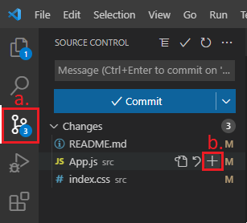

# Common git commands
| Commands                       | Description                                                                                                  |
|--------------------------------|--------------------------------------------------------------------------------------------------------------|
| `git clone repo-url` | Download the codebase to your local machine                                                                  |
| `git pull`                     | Update the current branch with the latest changes                                                            |
| `git checkout branch-name`     | Swap to a branch called "branch-name"                                                                        |
| `git checkout -b branch1`      | Create a new branch called "branch1" using the existing code from the current branch, and swap to "branch1" |
| `git commit -m "hello"`        | Create a snapshot of your changes (ie. a commit) with a description, "hello"                                 |
| `git push`                     | Upload commits to the online repository                                                                      |
| `git reset --soft HEAD~1`      | Undo last commit and keep the changes                                                                        |
| `git reset --hard`             | Undo last commit and discard the changes                                                                     |

# Table of Content
### First time setup (one time)
  - [Clone the repository](first-time-setup)
  - [Install packages](first-time-setup)
  - [Check for environmental variables](first-time-setup)
### Developing a ticket
- Before coding
  - [Assign yourself to the ticket](#1-assign-yourself-to-the-ticket)
  - [Create a new branch for your code](#2-create-a-new-branch-for-your-code)
  - [Start the local environment](#3-start-the-local-environment)
- While coding
  - [Stage your changes](#4-stage-your-changes)
  - [Commit your changes](#5-commit-your-changes)
  - [Undoing your commits (Optional)](#6-undoing-your-commits-optional)
- After coding
  - [Merge your branch with changes from `develop`](#7-merge-your-branch-with-changes-from-develop)
  - [Resolve merge conflicts](#8-resolve-merge-conflicts)
  - [Push your changes](#9-push-your-code)
  - [Create a PR (pull request)](#10-create-a-pr-pull-request)
  - [Notify people](#11-notify-people)

# First time setup
```
git clone https://github.com/GoToGroMSP-20/GoToGroMSP-20.git
npm install
```
- If the project has an `.env.example` file, duplicate it and rename the file into `.env`. To learn more about environment variable, it's basically variables that hackers can't get if they chose to hack our app.

# Flow of developing a ticket
## Before coding
### 1. Assign yourself to the ticket
- Drag the ticket you're planning to work on to the `Doing` column. The Trello board will automatically assign you to the ticket when you do it.

### 2. Create a new branch for your code
```
git checkout develop
git pull
git checkout -b 01-ticket-name
```
Explanation:
- Swap to `develop` branch
- Update `develop` with the latest changes
- Create a new branch using existing code from `develop` and swap to it. Branch naming convention is `ticketnumber-ticket-name`

### 3. Start the local environment
This will allow you to see your changes in the browser locally:
```
npm start
```

## While coding
It's recommended that you either regularly commit your code, or do small consecutive commits at the end when you've finished developing your feature, instead of including everything in 1 big commit. This is because if something goes wrong, big commits are harder to revert since you may not want to revert all of your changes. 

### 4. Stage your changes


a. Go to the "Source Control" tab in VSCode

b. Choose what you'd like to commit by clicking the `+` button next to the files. You can also choose all files by hovering over "Changes" and clicking the `+` button next to it instead)

### 5. Commit your changes
```
git commit -m "feat(feature-name): what you did"
```
There are 3 types of commits you can do. Depending on the type of commits you make you'll need to include a different prefix for your commit message:
- Adding a new feature: `feat`
- Making a fix/improvement: `fix`
- Writing documentations: `doc`

### 6. Undoing your commits (Optional)
```
git reset --soft HEAD~1
```
Run this command if you'd like to undo your last commit. You can repeatedly execute this to continue reverting back (Note that the previous reverted changes will pile up on top of the next reverted changes).

## After coding

### 7. Merge your branch with changes from `develop`
We do this to make sure that our branch is always compatible with `develop` to be merged in. Make sure you've committed everything you needed before you do this.
```
git checkout develop
git pull
git checkout 01-your-branch
git merge develop
```
Explanation:
- Swap to `develop` branch
- Update `develop` with the latest changes
- Swap back to your feature branch
- Merge changes from `develop` into the feature branch

### 8. Resolve merge conflicts
Scenario: You've run `git merge develop`, now you're seeing this in your code: 
```
<<<<<<< HEAD
// Code A
=======
// Code B
>>>>>>> develop
```
This means you're having a merge conflict:
- The code between `<<<<<<< HEAD` and `=======` is the code in your current branch
- The code between `=======` and `>>>>>>> develop` is the code from the `develop` branch

These 2 blocks of code are competing for the same spot. And you'll need to resolve this before you can commit your code.
- If you only want changes from your branch, delete everything except `// Code A`
- If you only want changes from `develop`, delete everything except `// Code B`
- If you want both changes, delete the symbols (`<<<<<<< HEAD`, `=======` and `>>>>>>> develop`). Same thing for if you want bits from this and bits from that

### 9. Push your code
```
git push
```
If you're pushing for the first time in a new branch, you will get something like this. Just copy paste the one shown in your terminal and press Enter to run it instead.
```
git push --set-upstream origin branch-name
```

### 10. Create a PR (Pull Request)
- Visit the GitHub repo page
- Start a PR by either pressing `Compare & Pull Request` (will only be visible if you've *just* pushed your changes), or if the button is not available you can click on Pull Request > New Pull Request. Both methods will take you to the same screen
- Convention:
    - If the PR is for a feature, the base should always be `develop`.
    - If the PR is for deploying a feature to the user's environment, the base should always be `main`
    - PR name to be `ticketnumber - Ticket Name`
    - Message to have a short change summary

### 11. Notify people
- Move ticket over to Pull Request column
- Send a message in discord